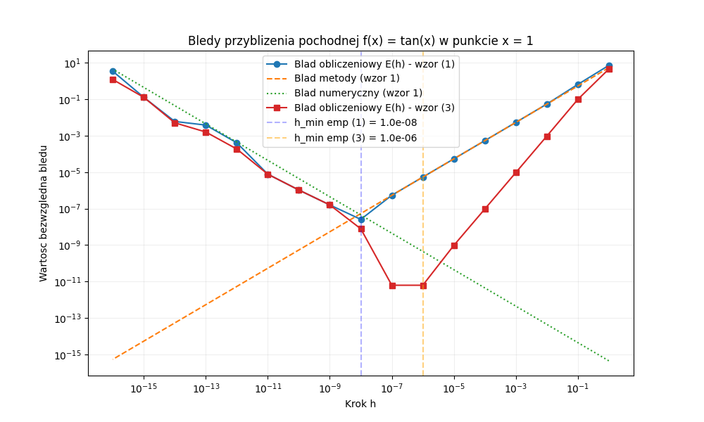

**Autor:** Jakub Staniszewski, Jacek Łoboda 
**Data:** 16 marca 2026 r.  
**Laboratorium nr:** 1  
**Temat lab:** Analiza błędów

---

## 1. Treść zadań

* **Zadanie 1:** Oblicz przybliżoną wartość pochodnej funkcji, używając wzoru na różnicę progresywną $f^{\prime}(x) \approx \frac{f(x+h)-f(x)}{h}$. Sprawdź działanie programu dla funkcji $\tan(x)$ w punkcie $x=1$. Powtórz ćwiczenie, używając wzoru różnic centralnych. Na wspólnym rysunku przedstaw wykresy wartości bezwzględnej błędu metody, błędu numerycznego oraz błędu obliczeniowego w zależności od kroku $h$.
* **Zadanie 2:** Przepisz podane wyrażenia (np. $\sqrt{x+1}-1$ dla $x \approx 0$ oraz $x^2-y^2$ dla $x \approx y$), tak aby zmniejszyć błąd numeryczny dla wskazanych argumentów.
* **Zadanie 3:** Rozważana jest funkcja $f(x) = \frac{e^x-1}{x}$ dla $x \neq 0$ oraz $f(x) = 1$ dla $x = 0$. Zaproponuj sposób obliczania funkcji o lepszych własnościach numerycznych, korzystając z rozwinięcia w szereg Taylora oraz funkcji `expm1`.
* **Zadanie 4:** Napisz program obliczający sumę $n$ liczb zmiennoprzecinkowych pojedynczej precyzji, losowo rozłożonych w przedziale [0,1]. Sumę należy obliczyć na 5 sposobów, wykorzystując m.in. różne typy akumulatorów, sortowanie elementów oraz algorytm Kahana z kompensacją błędu.

---

## 2. Argumentacja rozwiązania zadań i fragmenty algorytmu

### Zadanie 1
Pochodna numeryczna jest obarczona dwoma rodzajami błędów: błędem metody (wynikającym z ucięcia szeregu Taylora) rosnącym wraz z $h$ oraz błędem numerycznym (błędem zaokrągleń) rosnącym przy bardzo małych $h$ z powodu utraty cyfr znaczących przy odejmowaniu zbliżonych wartości. Oczekujemy wykresu w kształcie litery "V", gdzie dno określa minimalny możliwy błąd.

```python
for k, h in zip(k_vals, h_vals):
    df_fw = (f(x + h) - f(x)) / h
    err_1 = np.abs(df_fw - exact)
    
    df_cd = (f(x + h) - f(x - h)) / (2.0 * h)
    err_2 = np.abs(df_cd - exact)
```

### Zadanie 2
Bezpośrednie ewaluowanie wyrażeń takich jak różnica pierwiastków lub zbliżonych wartości potęg prowadzi do błędu kancelacji numerycznej. Przekształcenie algebraiczne (np. mnożenie przez sprzężenie, wzory skróconego mnożenia, tożsamości trygonometryczne) usuwa zjawisko utraty precyzji. Poniżej przedstawiono implementację z wykorzystaniem wyższej precyzji modułu `decimal`.

```python
def calculate_error_a():
    x = dec.Decimal('1e-11')
    f1 = (x + 1).sqrt() - 1
    f1_stable = x / ((x + 1).sqrt() + 1)
    
def calculate_error_b():
    x = dec.Decimal('1.00000000001')
    y = dec.Decimal('1.00000000000')
    f2 = (x*x) - (y*y)
    f2_stable = (x - y) * (x + y)
```

### Zadanie 3
Dla małych $x$ odejmowanie $e^x - 1$ skutkuje błędami zaokrągleń. Zastosowanie szeregu Taylora wyodrębnia wyrazy sprawiające problem. Dedykowana funkcja biblioteczna `expm1` realizuje to zadanie w tle i podnosi stabilność.

```python
def f1(x):
    if x == 0:
        return 1.0
    return (np.exp(x) - 1.0) / x

def f3(x):
    return 1.0 + x/2.0 + (x**2)/6.0 + (x**3)/24.0

def f4(x):
    if x == 0:
        return 1.0
    return np.expm1(x) / x
```

### Zadanie 4
Sumowanie milionów małych liczb typu `float32` do wspólnego akumulatora powoduje ignorowanie składników na skutek asymetrii rzędu wielkości pomiędzy małą dodawaną liczbą a dużą akumulowaną sumą. Algorytm Kahana rozwiązuje ten problem, wprowadzając pomocniczą zmienną korekcyjną `err`. 

```python
def sum_c(numbers):
    total = np.float32(0.0)
    err = np.float32(0.0)
    for x in numbers:
        y = np.float32(x - err)
        temp = np.float32(total + y)
        err = np.float32(np.float32(temp - total) - y)
        total = temp
    return total
```

---

## 3. Wykresy, tabele, wyniki liczbowe

### Wykres: Zadanie 1


### Tabela wyników: Zadanie 2
| Oryginalna | Stabilna | Argumenty | Wartość_og | Wartość_st |
|:----------:|:--------:|:---------:|:----------:|:-------------:|
| $\sqrt{x+1}-1$ | $\frac{x}{\sqrt{x+1}+1}$ | $x = 10^{-11}$ | 0.00000 | 5E-12 | 
| $x^2 - y^2$ | $(x-y)(x+y)$ | $x = 1.0000000001$<br>$y = 1.0000000000$ | 0E-9 | 2E-13 |

### Wykres: Zadanie 3


### Wykres: Zadanie 4


---

## 4. Wnioski, obserwacje, uwagi

* **Zadanie 1:** Wykres błędu posiada wyraźne minimum. Osiągnięcie najniższego błędu waha się na granicy wpływu błędu obcięcia oraz utraty precyzji obliczeniowej. Metoda różnic centralnych jest weryfikowalnie znacznie dokładniejsza (rząd rzędu $\approx 10^{-11}$) niż metoda progresywna (rząd $\approx 10^{-8}$).
* **Zadanie 2:** Wyniki $0.00000$ lub $0E-9$ w oryginalnych równaniach (przy niezerowym matematycznie wyniku) dowodzą, jak niefortunny układ operacji prowadzi do całkowitej utraty informacji na drodze błędów kancelacji. Zastosowanie odpowiednich wzorów jest fundamentem stabilności algorytmu.
* **Zadanie 3:** Powszechne biblioteczne metody numeryczne ulegają znaczącej degradacji stabilności, gdy stosowane są blisko wartości granicznych (jak ułamek w rejonie bliskim zeru). Dedykowane transformacje (np. szereg Taylora lub optymalizowane niskopoziomowo instrukcje typu `expm1`) całkowicie stabilizują obszar numerycznej "niepewności".
* **Zadanie 4:** Algorytm Kahana zawsze oferuje najdokładniejsze podejście z uwagi na stałą kompensację zmiennoprzecinkową i drastycznie redukuje błąd względem prostej akwizycji dla `float32`. Użycie akumulatora o większej pojemności `float64` to jednak z reguły najprostsza ścieżka do redukcji błędu.

---

## 5. Bibliografia

1. Materiały dydaktyczne do laboratorium: *Analiza błędów* (lab1.pdf)
2. Oficjalna dokumentacja pakietu `NumPy` oraz wizualizacje za pomocą biblioteki `Matplotlib`
3. Dokumentacja standardowej wbudowanej biblioteki `decimal`