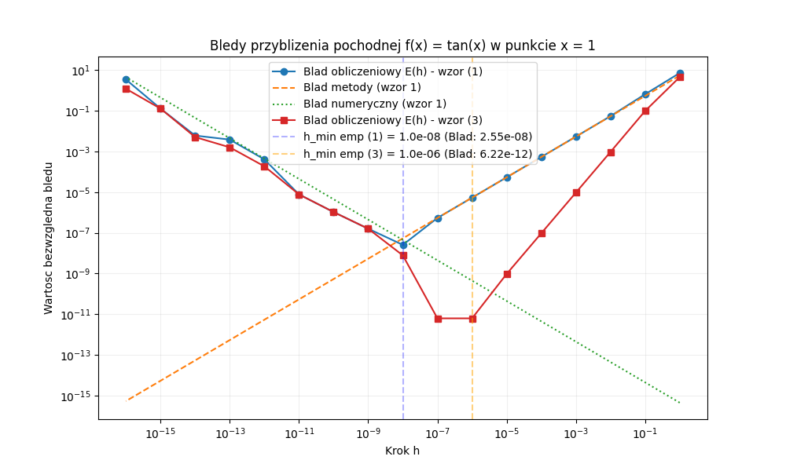
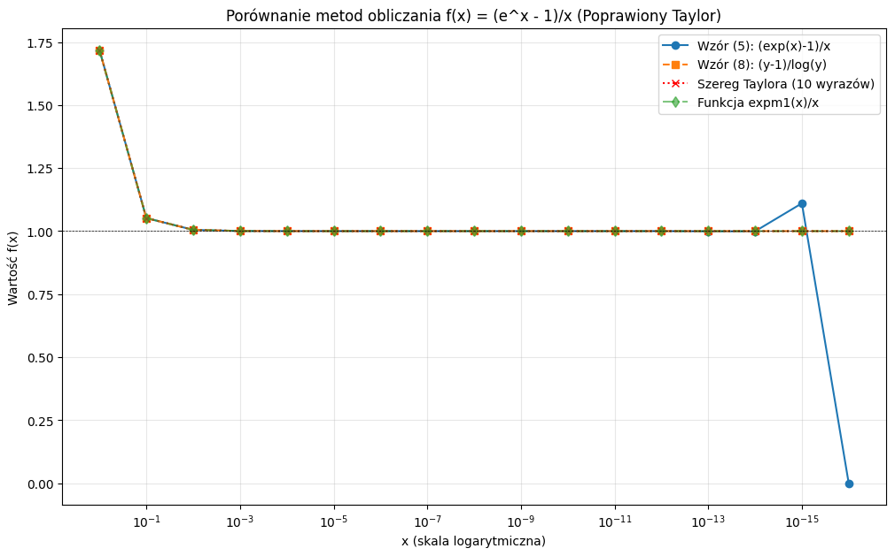
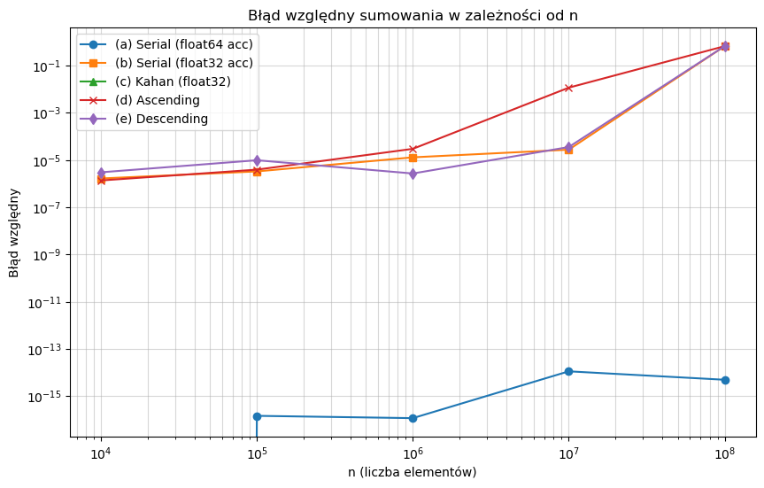

**Autor:** Jakub Staniszewski, Jacek Łoboda 
**Data:** 16 marca 2026 r.  
**Laboratorium nr:** 1  
**Temat lab:** Analiza błędów

---

## 1. Treść zadań

* **Zadanie 1:** Oblicz przybliżoną wartość pochodnej funkcji, używając wzoru na różnicę progresywną $f^{\prime}(x) \approx \frac{f(x+h)-f(x)}{h}$. Sprawdź działanie programu dla funkcji $\tan(x)$ w punkcie $x=1$. Powtórz ćwiczenie, używając wzoru różnic centralnych. Na wspólnym rysunku przedstaw wykresy wartości bezwzględnej błędu metody, błędu numerycznego oraz błędu obliczeniowego w zależności od kroku $h$.
* **Zadanie 2:** Przepisz podane wyrażenia, tak aby zmniejszyć błąd numeryczny dla wskazanych argumentów.
* **Zadanie 3:** Rozważana jest funkcja $f(x) = \frac{e^x-1}{x}$ dla $x \neq 0$ oraz $f(x) = 1$ dla $x = 0$. Zaproponuj sposób obliczania funkcji o lepszych własnościach numerycznych, korzystając z rozwinięcia w szereg Taylora oraz funkcji `expm1`.
* **Zadanie 4:** Napisz program obliczający sumę $n$ liczb zmiennoprzecinkowych pojedynczej precyzji, losowo rozłożonych w przedziale [0,1]. Sumę należy obliczyć na 5 sposobów, wykorzystując m.in. różne typy akumulatorów, sortowanie elementów oraz algorytm Kahana z kompensacją błędu.

---

## 2. Argumentacja rozwiązania zadań i fragmenty algorytmu

### Zadanie 1
Pochodna numeryczna jest obarczona dwoma rodzajami błędów: błędem metody (wynikającym z ucięcia szeregu Taylora) rosnącym wraz z $h$ oraz błędem numerycznym (błędem zaokrągleń) rosnącym przy bardzo małych $h$ z powodu utraty cyfr znaczących przy odejmowaniu zbliżonych wartości. Oczekujemy wykresu w kształcie litery "V", gdzie dno określa minimalny możliwy błąd.

```python
for k, h in zip(k_vals, h_vals):
    df_fw = (f(x + h) - f(x)) / h
    err_1 = np.abs(df_fw - exact)
    
    df_cd = (f(x + h) - f(x - h)) / (2.0 * h)
    err_2 = np.abs(df_cd - exact)
```


<center>
Rys. 1. Wykres zależności wartości bezwględnej błędu od wartości błędu h.
</center>


#### Wnioski: 

Wykres błędu posiada wyraźne minimum dla obu metod, zwane $h_{min\_emp}$. Osiągnięcie najniższego błędu waha się na granicy wpływu błędu obcięcia oraz utraty precyzji obliczeniowej. Metoda różnic centralnych jest weryfikowalnie znacznie dokładniejsza niż metoda progresywna.

Dla wzoru na różnicę progresywną (1), wartość $h_{min\_emp}$ wynosi $1.0\times 10^{-8}$, a minimalny wyznaczony błąd bezwzględny oscyluje wokół $1.16\times 10^{-8}$. Dla różnicy centralnej (3), wartość $h_{min\_emp}$ wynosi $1.0\times 10^{-5}$, co redukuje ostateczny minimalny błąd bezwzględny do zaledwie $6.15\times 10^{-12}$.

---

### Zadanie 2

Poniżej przedstawiono przekształcenia mające na celu zmniejszenie błędu numerycznego dla wskazanych argumentów.

- $\sqrt{x+1}-1$, $x \approx 0$
  $$\frac{(\sqrt{x+1}-1)(\sqrt{x+1}+1)}{\sqrt{x+1}+1} = \frac{x+1-1}{\sqrt{x+1}+1} = \mathbf{\frac{x}{\sqrt{x+1}+1}}$$

- $x^{2}-y^{2}$, $x \approx y$
  $$\mathbf{(x-y)(x+y)}$$

- $\frac{1-\cos x}{\sin x}$, $x \approx 0$
  $$\frac{2\sin^{2}(x/2)}{2\sin(x/2)\cos(x/2)} = \frac{\sin(x/2)}{\cos(x/2)} = \mathbf{\tan(x/2)}$$

- $\sin x - \sin y$, $x \approx y$
  $$\mathbf{2\sin\left(\frac{x-y}{2}\right)\cos\left(\frac{x+y}{2}\right)}$$

- $\frac{a+b}{2}$ (bisekcja odcinka $[a, b]$)
  $$\mathbf{a + \frac{b-a}{2}}$$

- $\text{softmax}(x)_{i} = \frac{\exp(x_{i})}{\sum_{j}\exp(x_{j})}$
  $M = \max(x)$ $$\mathbf{\frac{\exp(x_{i} - M)}{\sum_{j}\exp(x_{j} - M)}}$$

<center>

| Oryginalna | Stabilna | Argumenty | Wartość_og | Wartość_st |
|:----------:|:--------:|:---------:|:----------:|:-------------:|
|$\mathbf{\sqrt{x+1}-1}$|$\mathbf{\frac{x}{\sqrt{x+1}+1}}$| $\mathbf{x = 10^{-11}}$ | $\mathbf{0}$ | $\mathbf{5E-12}$ | 
| $\mathbf{x^2 - y^2}$ | $\mathbf{(x-y)(x+y)}$ | $\mathbf{x = 1.000000001}$ $\mathbf{y = 1.000000000}$ | $\mathbf{0}$ | $\mathbf{2E-13}$ |


Tabela 1. Różnice w wartościach oryginalnej i stabilnej wersji wyrażeń na przykładzie dwóch podpunktów, precyzja wynosi 10 cyfr znaczących.
</center>

<br>

#### Wnioski:
- Nawet poprawna matematycznie metoda może produkować błędne wyniki w arytmetyce komputerowej, dlatego postać wzoru jest kluczowa dla stabilności.

- Błąd kancelacji można skutecznie wyeliminować poprzez przekształcenia algebraiczne takie jak faktoryzacja.

- Otrzymanie wyniku 0 w wersji oryginalnej przy niezerowym wyniku wersji stabilnej dowodzi utraty informacji na skutek zaokrągleń.

---

### Zadanie 3
Dla małych $x$ odejmowanie $e^x - 1$ skutkuje błędami zaokrągleń. Zastosowanie szeregu Taylora wyodrębnia wyrazy sprawiające problem. Dedykowana funkcja biblioteczna `expm1` realizuje to zadanie w tle i podnosi stabilność.

```python
def f1(x):
    if x == 0:
        return 1.0
    return (np.exp(x) - 1.0) / x

def f2(x):
    y = np.exp(x)
    if y == 1.0:
        return 1.0
    return (y - 1.0) / np.log(y)

def f3(x):
    n_terms = 10
    result = 0.0
    for i in range(n_terms):
        result += (x**i) / factorial(i + 1)
    return result

def f4(x):
    if x == 0:
        return 1.0
    return np.expm1(x) / x
```




<center>
Rys. 2. Wykres zależności wartościfunkcji od jej argumentu.
</center>

#### Wnioski:
Powszechne biblioteczne metody numeryczne ulegają znaczącej degradacji stabilności, gdy stosowane są blisko wartości granicznych (jak ułamek w rejonie bliskim zeru). Dedykowane transformacje (np. szereg Taylora lub optymalizowane niskopoziomowo instrukcje typu `expm1`) całkowicie stabilizują obszar numerycznej "niepewności".

---

### Zadanie 4
Celem ćwiczenia było porównanie pięciu metod sumowania $n$ liczb typu float32 z przedziału [0, 1] względem wyniku wzorcowego z math.fsum()

#### Metody:
- Sumowanie losowe z akumulatorem float64
- Sumowanie losowe z akumulatorem float32
- Algorytm Kahana (kompensacja błędu), float32
- Sumowanie po posortowaniu rosnąco, float32
- Sumowanie po posortowaniu malejąco, float32



<center>
Rys. 3. Wykres zależności zaobserwowanego błędu sumowania od liczby sumowanych elementów.
</center>

#### Wnioski:
- Algorytm Kahana (c) za każdym razem daje najdokładniejszy wynik
- Zastosowanie akumulatora float64 (a) znacząco redukuje błąd względem metod 32-bitowych
- Standardowe metody (b, d, e) wykazują zbliżony poziom błędów przy niskiej precyzji obliczeń

---

## 5. Bibliografia

1. Materiały dydaktyczne do laboratorium: *Analiza błędów* (lab1.pdf)
2. Oficjalna dokumentacja pakietu `NumPy` oraz wizualizacje za pomocą biblioteki `Matplotlib`
3. Dokumentacja standardowej wbudowanej biblioteki `decimal`