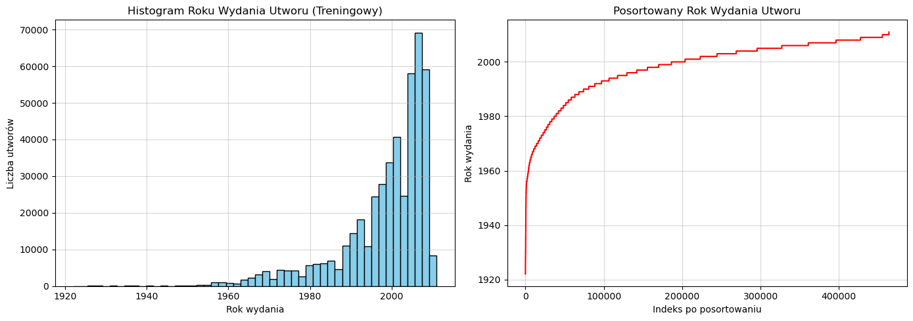

# METODY OBLICZENIOWE W NAUCE I TECHNICE
#### Autorzy: Jacek Łoboda, Jakub Staniszewski
#### Data: 24.03.2026
## Laboratorium 2 - Metoda najmniejszych kwadratów

### 1. Wprowadzenie i Cel Zadania
Celem niniejszego zadania jest zastosowanie metody najmniejszych kwadratów (MNK) do predykcji roku wydania utworów muzycznych. Podstawą do rozwiązania problemu jest zbiór danych `YearPredictionMSD.txt`. Pierwsza kolumna zbioru reprezentuje rok wydania, natomiast pozostałe kolumny to zbiór 90 cech akustycznych (12 cech to średnia barwa, a pozostałe 78 dotyczy kowariancji barwy). 

Zbiór został podzielony na część treningową, obejmującą pierwsze 463 715 przykładów, oraz zbiór testowy, składający się z pozostałych 51 630 przykładów. 

### 2. Wstępna Analiza Danych
Dane załadowano przy pomocy biblioteki `pandas`. Wygenerowano histogram oraz posortowany wykres kolumny reprezentującej rok wydania utworu. Analiza wykresów wskazuje, że większość utworów w zbiorze pochodzi z przełomu XX i XXI wieku, co sprawia, że rozkład danych jest lewoskośny.

Rys. 1. histogram i wykres obrazujący wczytane dane.

### 3. Przygotowanie Danych i Skalowanie
Zbudowano reprezentację danych dla MNK, wydzielając z oryginalnego zbioru wektor wyników oraz macierz cech:
* **Wektor $y$:** wektor kolumnowy przechowujący docelowy rok wydania utworu. Dla zbioru treningowego ma on wymiar $463 715 \times 1$.
* **Macierz $A$:** macierz obserwacji, w której każdy wiersz odpowiada jednemu utworowi, a kolumny przechowują 90 cech akustycznych. Aby model liniowy mógł uwzględnić przesunięcie w przestrzeni, macierz rozszerzono o dodatkową, początkową kolumnę wypełnioną samymi jedynkami. W efekcie macierz treningowa $A$ przyjmuje wymiar $463 715 \times 91$.

W celu sprawdzenia stabilności i dokładności modelu, wygenerowano drugą reprezentację znormalizowaną metodą *min-max scaling* do przedziału [0, 1]. Zastosowano następujący wzór dla cech (z pominięciem dodanej kolumny jedynek):
$$f_{scaled}=\frac{f-f_{min}}{f_{max}-f_{min}}$$
gdzie $f_{min}$ i $f_{max}$ to odpowiednio minimum i maksimum danej cechy dla zbioru treningowego. Analogicznie przeskalowano wektor wyjściowy roku wydania:
$$y_{scaled}=\frac{y-y_{min}}{y_{max}-y_{min}}$$

### 4. Wyznaczanie Wag i Warianty MNK
Wagi wektora dla nieznormalizowanych danych obliczono przy użyciu równania normalnego za pomocą funkcji `np.linalg.solve`. W celu porównania wykorzystano również inne warianty:
* **SVD (scipy.linalg.lstsq):** implementacja wykorzystująca rozkład SVD dla danych nieznormalizowanych.
* **Regularyzacja Tichonowa (Ridge):** zastosowano współczynnik kary $\lambda=0.01$ rozwiązując zregularyzowane równanie normalne.

### 5. Współczynnik Uwarunkowania Macierzy
Obliczono współczynnik uwarunkowania macierzy Grama $cond(A^T A)$ przy użyciu funkcji `np.linalg.cond` w celu oceny stabilności układu równań. Otrzymane wyniki prezentują się następująco:
* Uwarunkowanie macierzy nieznormalizowanej: **3.87e+09**
* Uwarunkowanie macierzy znormalizowanej: **2.15e+06**

Wniosek: Współczynnik uwarunkowania wpływa na liczbę cyfr znaczących w reprezentacji wag. Skalowanie metodą *min-max* znacząco zmniejszyło wartość współczynnika uwarunkowania, co dowodzi znacznej poprawy właściwości numerycznych i odporności modelu na błędy zaokrągleń.

### 6. Walidacja na Zbiorze Testowym
Dla każdego wariantu wykonano predykcję lat wydania na zbiorze testowym. W przypadku reprezentacji znormalizowanej, odwrócono transformację używając wzoru:
$$t_{unscaled}=\tilde{y}*(y_{max}-y_{min})+y_{min}$$

Jako miarę błędu przyjęto średni błąd bezwzględny. Otrzymane wyniki predykcji:
* Równanie Normalne, Nieznormalizowane: **6.8005 lat**
* Scipy lstsq/SVD, Nieznormalizowane: **6.8005 lat**
* Równanie Normalne Regularyzowane, lambda=0.01: **6.8005 lat**
* Równanie Normalne, Znormalizowane: **6.8005 lat**

Wniosek: Różnice między poszczególnymi wariantami są niemal niezauważalne w standardowej precyzji zmiennoprzecinkowej. Model średnio myli się w ocenie roku wydania o około 6.8 lat, co jest bardzo satysfakcjonującym wynikiem jak na prostą aproksymację liniową ogromnego zbioru różnorodnych utworów muzycznych.

### 7. Podejście Inkrementacyjne (Filtr Kalmana)
Model przeliczono w sposób inkrementacyjny. Podzielono zbiór macierzy treningowej na podmacierze $A_1$, $A_2$, $A_3$, $A_4$ po 100 000 wierszy oraz $A_5$ 63 715 wierszy. Zmierzono średni błąd bezwzględny po każdej iteracji na zbiorze testowym:
* Po bloku $A_1$ (100 000 próbek): MAE = **6.8461 lat**
* Po bloku $A_2$ (200 000 próbek): MAE = **6.8065 lat**
* Po bloku $A_3$ (300 000 próbek): MAE = **6.7998 lat**
* Po bloku $A_4$ (400 000 próbek): MAE = **6.8011 lat**
* Po bloku $A_5$ (463 715 próbek): MAE = **6.8005 lat**

Wniosek: Błąd ulegał szybkiej redukcji na wczesnym etapie uczenia (największy skok jakościowy nastąpił między 100 tys. a 300 tys. próbek), po czym wektor wag ustabilizował się na optymalnym poziomie. Zastosowanie metody inkrementacyjnej pozwala na efektywne uczenie modelu na dużych strumieniach danych bez konieczności ładowania całego zbioru do pamięci operacyjnej naraz.