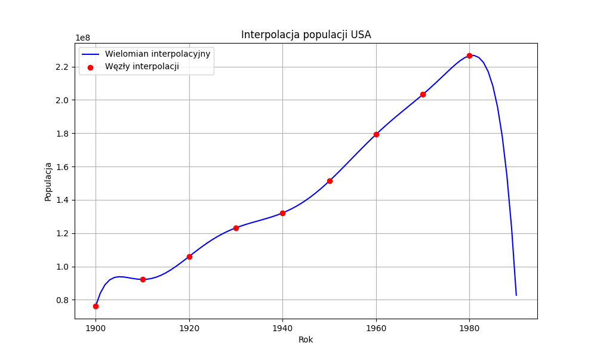
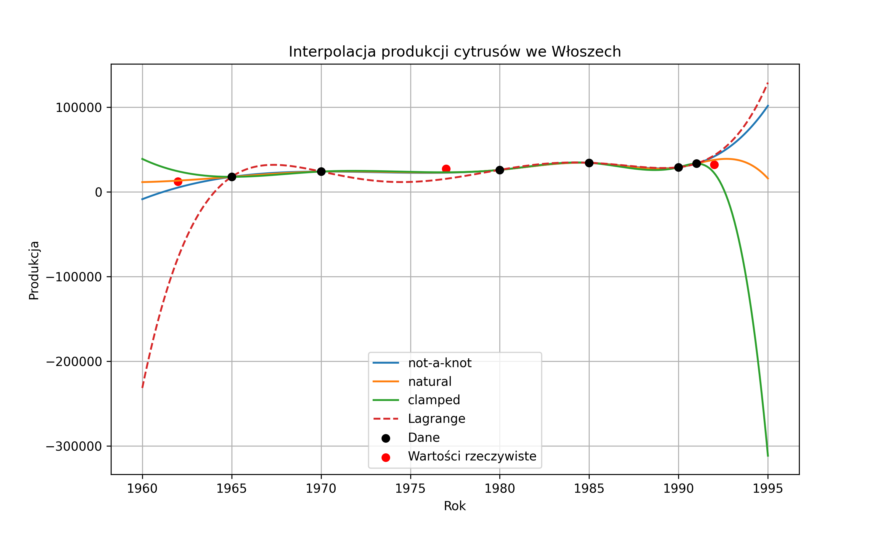

# Sprawozdanie: Interpolacja i Ekstrapolacja

## Zadanie 1. Analiza populacji Stanów Zjednoczonych (1900–1980)

W zadaniu analizowana jest populacja Stanów Zjednoczonych na przestrzeni lat. Celem jest zbudowanie wielomianu interpolacyjnego ósmego stopnia, który interpoluje podane dziewięć punktów.

### Konstrukcja macierzy Vandermonde'a i badanie uwarunkowania

Rozważono cztery różne bazy funkcji wielomianowych:

- $\phi_{j}(t)=t^{j-1}$
- $\phi_{j}(t)=(t-1900)^{j-1}$
- $\phi_{j}(t)=(t-1940)^{j-1}$
- $\phi_{j}(t)=\left(\frac{t-1940}{40}\right)^{j-1}$

Dla każdego z czterech zbiorów utworzono macierz Vandermonde'a i obliczono współczynnik uwarunkowania przy użyciu funkcji `numpy.linalg.cond`.

**Otrzymane wyniki:**
- Baza 1: $1.55 \cdot 10^{37}$
- Baza 2: $5.76 \cdot 10^{15}$
- Baza 3: $9.32 \cdot 10^{12}$
- Baza 4: $1.61 \cdot 10^{3}$

**Wniosek:**  
Baza nr 1 jest skrajnie źle uwarunkowana, co oznacza ogromną utratę precyzji numerycznej.  
Baza nr 4 jest zdecydowanie najlepiej uwarunkowana – przeskalowanie danych do przedziału $[-1,1]$ znacząco poprawia stabilność obliczeń.

---

### Wielomian interpolacyjny w najlepiej uwarunkowanej bazie

Używając bazy nr 4, wyznaczono współczynniki wielomianu:
[ 1.32164569e+08 4.61307656e+07 1.02716315e+08 1.82527130e+08
-3.74614715e+08 -3.42668456e+08 6.06291250e+08 1.89175576e+08
-3.15180235e+08]

Wartości obliczano przy użyciu schematu Hornera:

$$
P(x) = c_0 + x(c_1 + x(c_2 + \dots + x(c_{n-1} + x c_n)\dots))
$$

gdzie:

$$
x = \frac{t - 1940}{40}
$$

---

## Wykres interpolacji populacji USA

---

### Ekstrapolacja dla roku 1990

- Wynik ekstrapolacji: **82 749 141**
- Wartość rzeczywista: **248 709 873**
- Błąd względny: **66.7286%**

---

### Wielomiany Lagrange'a i Newtona

Obie metody prowadzą do tego samego wielomianu interpolacyjnego, różniąc się jedynie sposobem obliczeń.

---

### Analiza zaokrąglonych danych

Współczynniki po zaokrągleniu danych:
[ 1.32000000e+08 4.59571429e+07 1.00141270e+08 1.81111111e+08
-3.56755556e+08 -3.38488889e+08 5.70311111e+08 1.86920635e+08
-2.94196825e+08]

- Błąd względny po zaokrągleniu: **56.1738%**

**Wyjaśnienie:**  
Niewielka zmiana danych wejściowych powoduje dużą zmianę współczynników wielomianu. Wynika to z bardzo złego uwarunkowania problemu interpolacji wysokiego stopnia.

Dodatkowo, duży błąd ekstrapolacji jest skutkiem efektu Rungego – oscylacji wielomianu poza przedziałem danych.

---

## Zadanie 2. Analiza produkcji cytrusów we Włoszech

Do analizy wykorzystano dane z lat 1965–1991. Zastosowano splajny kubiczne oraz wielomian Lagrange'a.

### Porównanie błędów względnych

- Splajn **not-a-knot**:  
  `[0.5843, 0.1737, 0.3068]`

- Splajn **naturalny**:  
  `[0.0731, 0.1631, 0.1790]`

- Splajn **clamped**:  
  `[0.9639, 0.1561, 0.3086]`

- Wielomian **Lagrange'a**:  
  `[7.2862, 0.4401, 0.3432]`

---

## Porównanie metod interpolacji

---

### Wnioski końcowe

Funkcje sklejane trzeciego stopnia są znacznie bardziej stabilne niż wielomian globalny.

Najlepsze wyniki daje splajn naturalny, który ma najmniejsze błędy.  
Wielomian Lagrange'a wykazuje bardzo duży błąd (ponad 700%) przy ekstrapolacji, co potwierdza jego niestabilność poza zakresem danych.
W zastosowaniach inżynierskich i analitycznych należy unikać wielomianów wysokiego stopnia do ekstrapolacji. Zamiast tego zaleca się stosowanie funkcji sklejanych lub innych metod aproksymacji lokalnej.