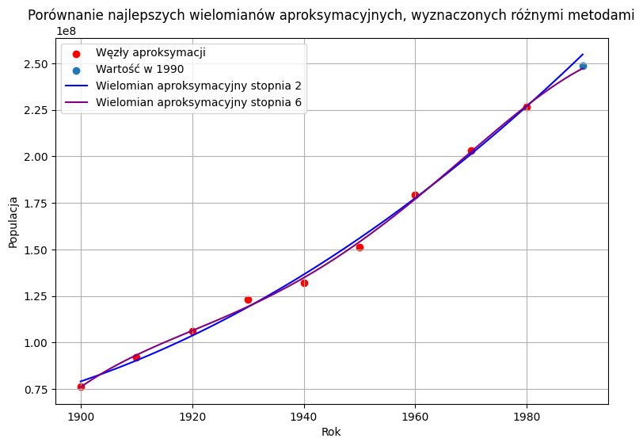
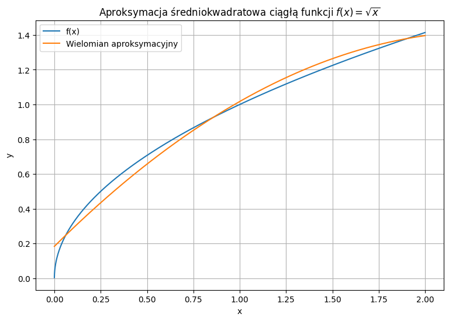

# MOWNIT Laboratorium 5  
## Aproksymacja  

**Autor:** Jakub Staniszewski, Jacek Łoboda
**Data:** 14.04.2026

---

## Zadanie 1

### Opis problemu

Celem zadania jest przeprowadzenie punktowej aproksymacji średniokwadratowej populacji Stanów Zjednoczonych na podstawie danych historycznych z lat 1900–1980. Aproksymację wykonano za pomocą wielomianów algebraicznych stopnia $m$, gdzie $0 \le m \le 6$. 

Następnie zbadano zdolności predykcyjne wyznaczonych modeli poprzez ekstrapolację wielomianów do roku 1990 i porównanie uzyskanych wyników z rzeczywistą wartością populacji w tym roku, która wynosiła 248 709 873 osób. Wybór optymalnego stopnia wielomianu przeanalizowano na dwa sposoby: poprzez analizę błędu względnego dla pojedynczego punktu w przyszłości (1990 r.) oraz przy użyciu kryterium informacyjnego Akaikego (AIC).

### Wyniki ekstrapolacji

W poniższej tabeli zestawiono wyniki przewidywań populacji na rok 1990 wygenerowane przez modele wielomianowe rzędu od 0 do 6 wraz z wartością błędu względnego w stosunku do populacji rzeczywistej.

| Stopień wielomianu ($m$) | Wartość ekstrapolowana | Błąd względny |
|:---:|:---:|:---:|
| 0 | 143 369 177 | 0.424 |
| 1 | 235 808 109 | 0.052 |
| 2 | 254 712 945 | 0.024 |
| 3 | 261 439 111 | 0.051 |
| 4 | 251 719 345 | 0.012 |
| 5 | 263 442 928 | 0.059 |
| 6 | 265 700 975 | 0.068 |

### Analiza błędów

Błąd względny dla punktu poddanego ekstrapolacji (1990 rok) wykazuje zauważalną zmienność. Najmniej dokładny model to, zgodnie z oczekiwaniami, wielomian stopnia zerowego (stała), ze względu na to, że populacja ma silny trend rosnący. Najdokładniejszy wynik w punkcie 1990 dał wielomian stopnia 4, dla którego błąd względny wyniósł zaledwie 0.012 (około 1.2%). Warto zauważyć, że modele o najwyższych stopniach (5 i 6) generują gorsze prognozy niż model czwartego, czy nawet drugiego stopnia, co sugeruje problem z nadmiernym dopasowaniem (overfittingiem).

### Kryterium Akaikego

Problem wyboru optymalnego stopnia wielomianu sprowadza się do znalezienia balansu pomiędzy zjawiskiem obciążenia (zbyt niski stopień i ignorowanie trendu danych) a wariancji (zbyt wysoki stopień uwzględniający szum w danych). Oceny globalnej jakości dopasowania modelu, karzącej go jednocześnie za nadmiarową złożoność, dokonuje się używając kryterium informacyjnego Akaikego ($AIC$). 

Standardowy wzór $AIC$ wyraża się jako:
$$AIC = 2k + n \ln\left(\frac{\sum_{i=1}^{n}[y_i - \hat{y}(x_i)]^2}{n}\right)$$

Gdzie:
* $n$ to liczba obserwacji (w naszym przypadku $n=9$),
* $k$ to liczba parametrów modelu (dla wielomianu stopnia $m$ wynosi ona $k = m + 1$),
* $y_i$ to prawdziwa liczba osób,
* $\hat{y}(x_i)$ to wartość przewidywana przez model aproksymacyjny.

Ze względu na to, że rozmiar próbki jest bardzo mały w stosunku do liczby estymowanych parametrów ($\frac{n}{k} < 40$), należało użyć wersji kryterium z członem korygującym ($AIC_c$):
$$AIC_c = AIC + \frac{2k(k+1)}{n-k-1}$$

Wartości poprawionego kryterium $AIC_c$ zestawiono w poniższej tabeli:

| Stopień wielomianu ($m$) | $AIC_c$ |
|:---:|:---:|
| 0 | 320.884 |
| 1 | 288.556 |
| 2 | 278.082 |
| 3 | 281.547 |
| 4 | 284.672 |
| 5 | 300.868 |
| 6 | 320.208 |

**Interpretacja:** Im mniejsza wartość kryterium $AIC_c$, tym lepszy – w ujęciu teorii informacji – jest badany model. Analiza wartości wskazuje wyraźne minimum dla wielomianu stopnia $m=2$.

### Porównanie modeli

**Rysunek 1:** Porównanie przebiegu najlepszych wielomianów aproksymacyjnych, wyznaczonych na podstawie analizy błędu ekstrapolacji w jednym punkcie ($m=4$) oraz kryterium Akaikego ($m=2$).

### Wnioski

Stopień wielomianu wybrany na podstawie wskaźnika $AIC_c$ ($m=2$) nie pokrywa się ze stopniem modelu, który wygenerował najmniejszy błąd punktowy zjawiska ekstrapolacji ($m=4$). Taka rozbieżność jest zjawiskiem w pełni naturalnym i uzasadnionym teoretycznie:
1.  **Ekstrapolacja punktowa** w roku 1990 ma charakter weryfikacji lokalnej. Fakt, że krzywa wielomianu 4. stopnia przeszła bliżej jednej konkretnej wartości referencyjnej, jest w pewnym stopniu koincydencją wynikającą z zachowania ogona tego konkretnego wielomianu poza przedziałem aproksymacji.
2.  **Kryterium $AIC_c$** dokonuje oceny globalnej. Równoważy ono błąd dopasowania do znanych punktów na przedziale bazowym z "karą" za wprowadzanie nadmiarowych stopni swobody. 
3.  Z punktu widzenia bezpieczeństwa modelowania statystycznego i fizycznego sensu danych (wzrost populacji jest procesem stosunkowo płynnym), użycie wielomianu wyższego rzędu (np. $m=4$ lub wyżej) stwarza ogromne ryzyko gwałtownych oscylacji poza obszarem modelowania. Model kwadratowy ($m=2$) jest modelem znacznie bardziej stabilnym, odpornym na losowy szum i lepiej oddającym długoterminowy, rosnący trend w badanych danych populacyjnych. 

W ogólnym ujęciu, jako model referencyjny należy zawsze wskazywać ten wyznaczony metodą analityczną karzącą za złożoność (Kryterium Akaikego).

---

## Zadanie 2

### Opis problemu

Zadanie polegało na przeprowadzeniu ciągłej aproksymacji średniokwadratowej dla nieliniowej funkcji $f(x) = \sqrt{x}$ w przedziale bazowym $[0, 2]$. Ze względu na uwarunkowania numeryczne, jako bazy aproksymacyjnej użyto ortogonalnych wielomianów Czebyszewa pierwszego rodzaju do drugiego stopnia włącznie. Podejście to stanowi efektywną i tańszą obliczeniowo alternatywę dla aproksymacji jednostajnej (optymalnej wg kryterium minimaksowego).

### Funkcja wagowa

Wielomiany Czebyszewa są naturalnie definiowane dla przedziału $[-1, 1]$. Aby zastosować je do naszej docelowej dziedziny $x \in [0, 2]$, dokonano transformacji zmiennej poprzez proste podstawienie liniowe:
$$t = x - 1$$
co po przekształceniu powrotnym gwarantuje zachowanie odpowiednich przedziałów. Do budowy iloczynu skalarnego wielomianów Czebyszewa wykorzystuje się funkcję wagową postaci:
$$w(t) = \frac{1}{\sqrt{1 - t^2}}$$

### Wielomiany Czebyszewa

Trzy pierwsze wielomiany Czebyszewa ($n=0, 1, 2$) wykorzystane jako baza analityczna dla aproksymacji ciągłej przyjmują postać:
* $T_0(t) = 1$
* $T_1(t) = t$
* $T_2(t) = 2t^2 - 1$

### Aproksymacja

Współczynniki rozwinięcia $c_i$ w bazie Czebyszewa minimalizujące błąd średniokwadratowy obliczane są z wykorzystaniem standardowego iloczynu skalarnego z zadaną wyżej funkcją wagową $w(t)$:
$$c_i = \frac{\langle f, T_i \rangle}{\langle T_i, T_i \rangle} = \frac{\int_{-1}^{1} w(t) f(t+1) T_i(t) dt}{\int_{-1}^{1} w(t) T_i^2(t) dt}$$

Normy kwadratowe dla tych wielomianów (mianowniki równań) są wartościami ściśle zdefiniowanymi: 
* dla $i = 0$ wynoszą $\pi$, 
* dla $i > 0$ wynoszą $\frac{\pi}{2}$.

Ostatecznie badana funkcja zostaje przybliżona sumą:
$$\hat{f}(x) = \sum_{i=0}^{2} c_i T_i(x-1)$$

**Rysunek 2:** Porównanie przebiegu funkcji oryginalnej $f(x) = \sqrt{x}$ oraz uzyskanego wielomianu aproksymacyjnego z bazy Czebyszewa.

### Wnioski

Na podstawie wygenerowanego wykresu i przebiegu funkcji można stwierdzić, że wyznaczony analitycznie wielomian niezwykle precyzyjnie aproksymuje funkcję $f(x) = \sqrt{x}$ na przeważającej części przedziału dziedziny. 

Jedyne widoczne – i matematycznie spodziewane – odchylenie zachodzi w bezpośrednim sąsiedztwie lewego brzegu przedziału (w okolicach $x=0$). Zjawisko to wynika bezpośrednio z natury analitycznej samej badanej funkcji: pierwsza pochodna funkcji pierwiastkowej w zerze dąży do nieskończoności (asymptota pionowa stycznej), z kolei wielomiany algebraiczne zawsze charakteryzują się skończonymi wartościami pochodnych. Mimo tej fundamentalnej rozbieżności krzywizn w punkcie zerowym, zastosowanie ciągłej bazy wielomianów Czebyszewa 2. stopnia zagwarantowało znakomite i "spłaszczone" rozłożenie maksymalnego błędu przybliżenia wzdłuż analizowanego obszaru bez negatywnego powstawania oscylacji widocznych w bazach standardowych (jak na przykład w wielomianach Taylora).

---

## Źródła
1. Instrukcje do laboratorium `lab5.pdf`.
2. Wikipedia