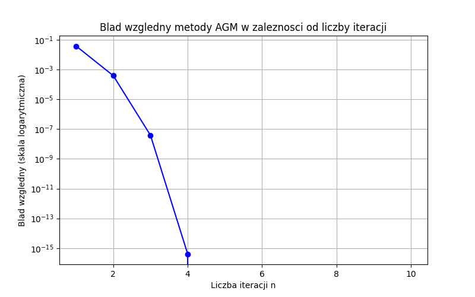
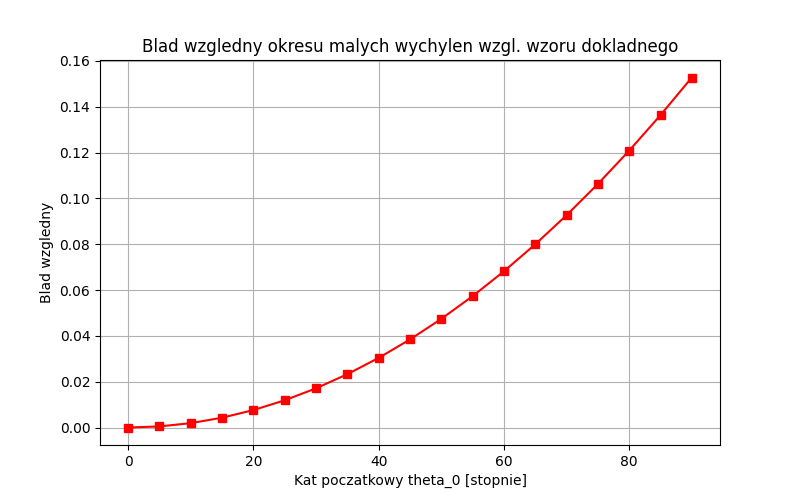

# Sprawozdanie: Metody numeryczne w problemach fizycznych
### Jakub Staniszewski, Łoboda Jacek
**Data:** 28.04.2026

---

## Zadanie 1: Kwadratury na danych tabelarycznych

### Opis problemu
Celem zadania było wyznaczenie prędkości strzały wypuszczanej z łuku. Mając zadaną masę strzały $m = 0.075$ kg oraz długość naciągu $L = 0.5$ m, należało skorzystać z zasady zachowania energii, przyrównując energię kinetyczną strzały do pracy włożonej w naciągnięcie łuku:
$$\frac{1}{2}mv^2 = \int_0^L F(x) dx$$

Zależność siły od wychylenia $F(x)$ podano w postaci danych tabelarycznych (11 punktów, 10 przedziałów), co wymagało zastosowania dyskretnego całkowania numerycznego.

### Wyniki i wnioski
Ze względu na parzystą liczbę przedziałów (10) i równą odległość pomiędzy węzłami ($h = 0.05$ m), optymalnym wyborem było zastosowanie złożonego wzoru Simpsona, który cechuje się wyższym rzędem dokładności niż metoda trapezów. 

Praca wykonana przy naciąganiu łuku wyniosła około $74.533$ J. Z przekształcenia wzoru na energię kinetyczną ($v = \sqrt{2W/m}$) uzyskano ostateczną prędkość strzały wynoszącą $44.58$ m/s. Wynik ten jest zgodny z fizycznymi rzędami wielkości oczekiwanymi dla tego typu układów mechanicznych.

---

## Zadanie 2: Całkowanie numeryczne funkcji ciągłych i osobliwości

### Opis problemu
Zadanie składało się z dwóch części związanych z układem masy na sprężynie z uwzględnieniem tarcia. 
W części (a) należało wyznaczyć prędkość początkową $v_0$ na podstawie całki z nieliniowej funkcji przyspieszenia $f(x)$. 
W części (b) problem polegał na obliczeniu stałej czasowej $C$ z całki posiadającej osobliwość w prawym końcu przedziału całkowania ($z=1$):
$$C = \int_0^1 \frac{1}{\sqrt{(\sqrt{2}-1)^2 - (\sqrt{1+z}-1)^2}} dz$$

### Wyniki i wnioski
Do wykonania całkowania użyto algorytmu adaptacyjnego z biblioteki `scipy.integrate.quad`. 
*   **Część (a):** Całkowanie funkcji $f(x)$ na przedziale $[0, 0.4]$ przebiegło bez problemów stabilnościowych. Uzyskano wartość pracy pozwalającą wyznaczyć prędkość startową $v_0 = 1.0965$ m/s.
* **Część (b):** Osobliwość w punkcie $z=1$ sprawia, że mianownik funkcji podcałkowej dąży do zera. Jest to jednak osobliwość całkowalna. Analiza matematyczna pozwala ustalić dokładną wartość tej całki analitycznie jako $2\sqrt{2}-2+\pi \approx 3.970019$. Algorytm `quad` skutecznie obsłużył to zachowanie asymptotyczne. Wartość stałej wyliczona numerycznie wynosi $C = 3.970020$, co pokrywa się z wartościa analityczną do 5 cyfr znaczących. Całkowity czas wyniósł $t = 0.397002$ s.

---

## Zadanie 3: Wahadło matematyczne i całki eliptyczne

### Opis problemu
Dla wahadła o amplitudzie $\theta_0 = 45^\circ$, precyzyjny okres drgań wyrażony jest przez zupełną całkę eliptyczną pierwszego rodzaju $K(k)$. Zbadano dwie metody wyznaczania tej całki:
1.  Bezpośrednie całkowanie numeryczne na przedziale $[0, \pi/2]$.
2.  Wykorzystanie algorytmu średniej arytmetyczno-geometrycznej (AGM).

Dodatkowo zbadano narastanie błędu przybliżenia okresu małych drgań ($T_0 = 2\pi\sqrt{l/g}$) wraz ze wzrostem amplitudy startowej.

### Wyniki i wnioski
Dla zadanego wychylenia początkowego $45^\circ$, obie zaimplementowane metody (bezpośrednie kwadratury oraz algorytm AGM) pozwoliły na wyznaczenie wartości całki $K(k) \approx 1.6336$. Na podstawie tej wartości, dla wahadła o długości $l=1$ m, precyzyjny okres drgań wyniósł $T \approx 2.0863$ s.

Metoda bezpośredniego całkowania numerycznego (kwadratury) z wykorzystaniem algorytmu `scipy.integrate.quad` poradziła sobie z wyznaczeniem wartości całki bez problemów ze zbieżnością. Warto jednak zauważyć, że metoda AGM charakteryzuje się szybką zbieżnością kwadratową, co czyni ją znacznie wydajniejszą obliczeniowo. Analiza wykresu błędu względnego dla metody AGM (względem zaimplementowanej w SciPy funkcji `ellipk`) pokazała, że już w 4-5 iteracji błąd spada do poziomu (rzędu $10^{-16}$).

Wykres błędu wzoru przybliżonego na okres wahadła udowodnił, że założenie o małych wychyleniach ($\sin\theta \approx \theta$) jest akceptowalne dla kątów do ok. $10^\circ-15^\circ$. Dla maksymalnego badanego kąta $90^\circ$, błąd względny aproksymacji liniowej rośnie do około $18\%$.
Dla kąta 45° błąd względny aproksymacji wynosi 3.844%. Z kolei dla maksymalnego badanego kąta 90°, błąd ten rośnie do około 18%.

