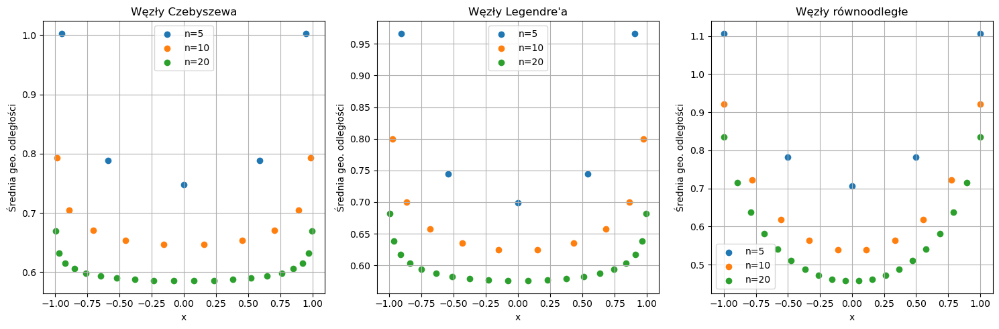
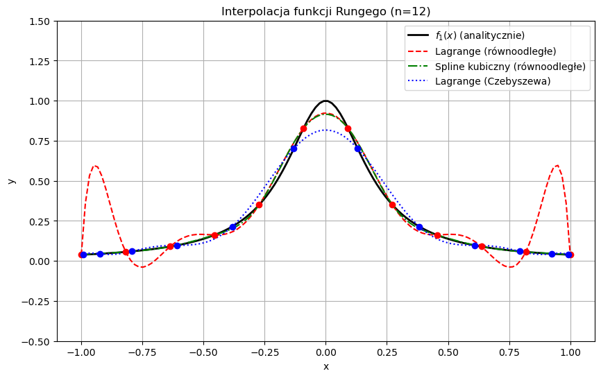
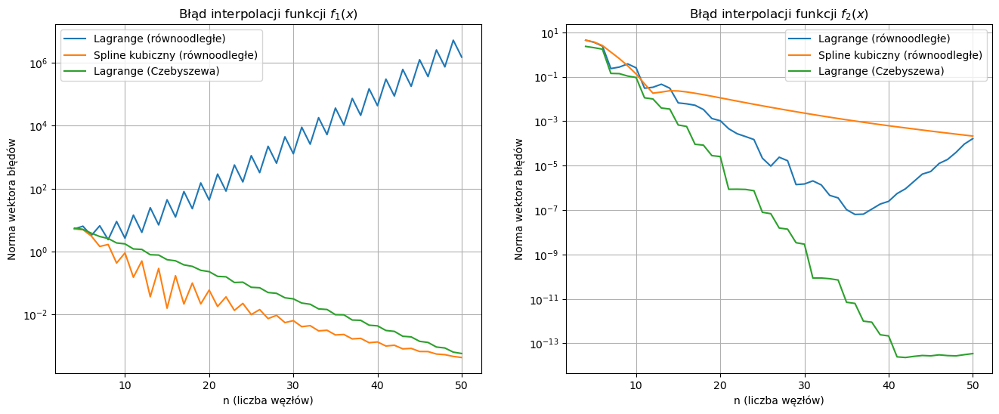

# MOWNIT laboratorium 4
## Efekt Rungego

**Imię i nazwisko:** Jacek Łoboda, Jakub Staniszewski  
**Data:** 07.04.2026  

---

### Zadanie 1

Celem pierwszego zadania było porównanie średniej geometrycznej odległości od siebie różnych zbiorów punktów. Analizę przeprowadzono dla ilości węzłów $n=10, 20, 50$. Zbadano następujące zbiory:
* punkty Czebyszewa,
* punkty Legendre'a,
* punkty rozłożone równomiernie.

**Punkty Czebyszewa**
Na przedziale $x \in [-1,1]$ punkty Czebyszewa wyraża się wzorem $t_{i}=-\cos(\frac{2i-1}{2n}\pi)$ dla $i=1,2,...n$.

**Punkty Legendre'a**
Punkty te wyznaczane są jako miejsca zerowe wielomianów Legendre'a. Do ich wyznaczenia uzyto funkcji numpy.polynomial.legendre.legroots().

**Punkty rozłożone równomiernie**
Wyznaczenie tych punktów jest trywialne.

**Wnioski:**
Wykresy jednoznacznie pokazują, że węzły Czebyszewa i Legendre'a są rozmieszczone w taki sposób, aby minimalizować średnią geometryczną odległości punktów od siebie (wartości są znacznie stabilniejsze na krańcach przedziału). W przypadku punktów rozłożonych równomiernie średnia odległość na brzegach przedziału gwałtownie rośnie, co sprzyja powstawaniu niestabilności interpolacji.

---

### Zadanie 2

W drugim zadaniu analizie poddano dwie funkcje:
1. $f_{1}(x)=\frac{1}{1+25x^{2}}$.
2. $f_{2}(x)=e^{\cos(x)}$.

Wykonano interpolację funkcji $f_{1}(x)$ z różną liczbą węzłów wykorzystując trzy metody:
* interpolację Lagrange'a z równoodległymi węzłami,
* interpolację kubicznymi funkcjami sklejanymi z równoodległymi węzłami,
* interpolację Lagrange'a z węzłami Czebyszewa.

W pierwszej części wygenerowano wykres funkcji $f_{1}(x)$ przy użyciu 12 węzłów interpolacji oraz wielomianami interpolacyjnymi wyznaczonymi każdą z 3 powyższych metod.

**Analiza błędów:**
Następnie przeprowadzono interpolację funkcji $f_{1}(x)$ i $f_{2}(x)$ używając od $n = 4$ do $n = 50$ węzłów interpolacji każdą z metod. Pozwoliło to na porównanie wektorów błędów dla różnych metod oraz różnej ilości węzłów i przedstawienie wyników na wykresach. 

**Wnioski:**
Interpolacja Lagrange'a oparta na węzłach równoodległych jest wysoce niestabilna przy wyższych rzędach, błąd zauważalnie rośnie wraz ze wzrostem liczby węzłów. Zastosowanie optymalnego rozmieszczenia punktów (węzły Czebyszewa) lub zmiana metody na kubiczne funkcje sklejane skutecznie eliminuje ten problem, co potwierdza stały spadek błędu na wygenerowanych wykresach.

---

### Wnioski Końcowe

Na podstawie wszystkich przeprowadzonych analiz sformułowano następujące wnioski:
* Punkty Legendre'a i Czebyszewa są rozłożone w taki sposób, aby minimalizować średnią geometryczną odległości punktów od siebie, co widać na wykresach z zadania pierwszego.
* Zastosowanie węzłów Czebyszewa w zadaniu drugim skutkowało otrzymaniem mniejszych błędów niż w przypadku użycia tej samej metody z węzłami równoodległymi.
* Przy interpolacji Lagrange'a opartej na równoodległych węzłach, błąd interpolacji rósł wraz ze wzrostem liczby węzłów.
* Skuteczność poszczególnych metod zależy od interpolowanej funkcji. W przypadku funkcji $f_{1}$ lepsze rezultaty dawały kubiczne funkcje sklejane, natomiast dla funkcji $f_{2}$ przewagę miała interpolacja Lagrange'a.
* Warto jednak zwrócić uwagę, że dla obu funkcji błąd interpolacji kubicznymi funkcjami sklejanymi malał wraz ze wzrostem liczby węzłów, a w przypadku interpolacji Lagrange'a z równoodległymi węzłami miejscami rósł.
