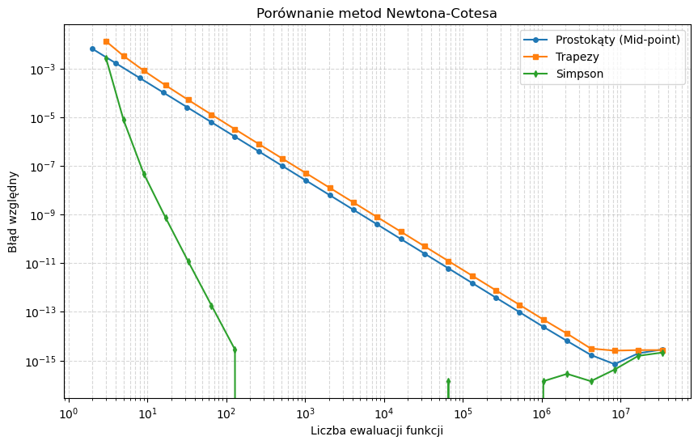
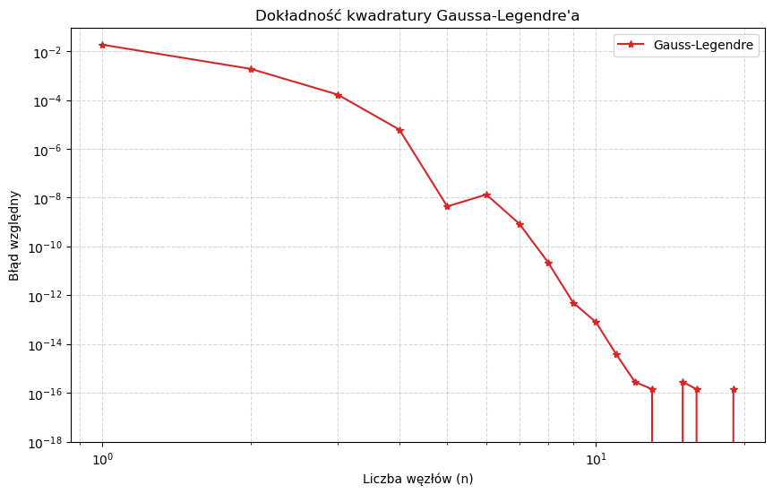
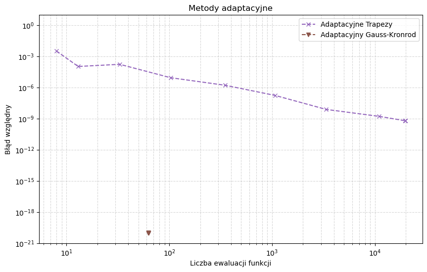
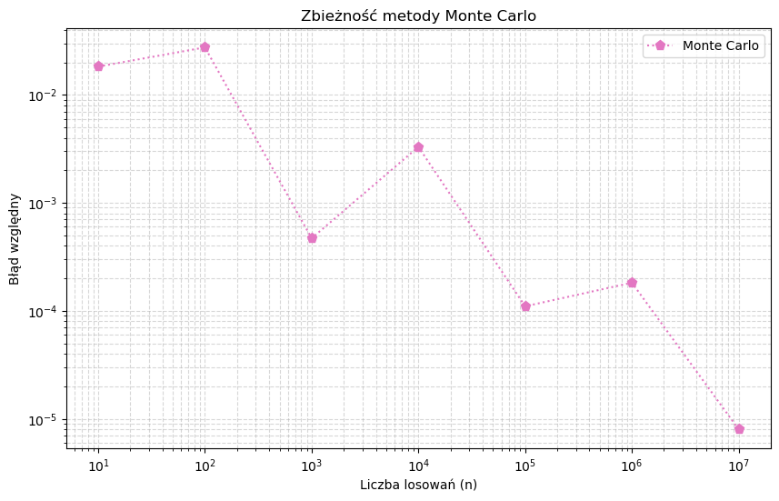
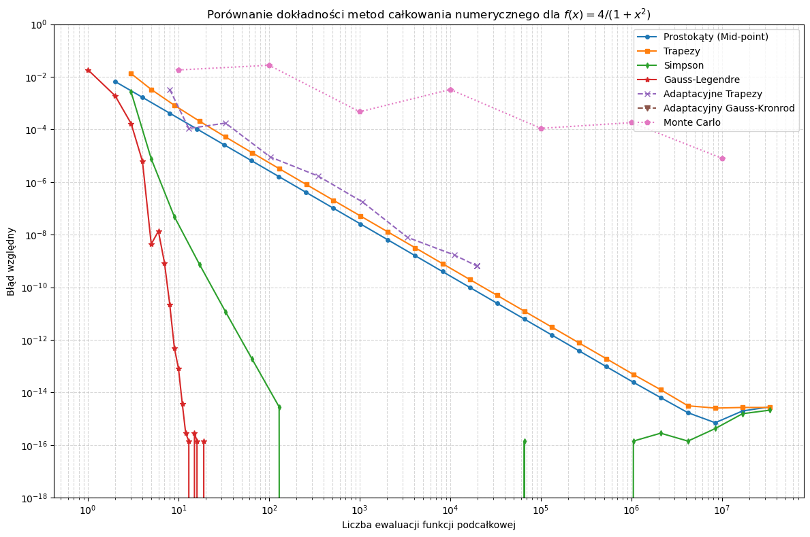

# Laboratorium 6: Kwadratury
**Autorzy: Jacek Łoboda, Jakub Staniszewski**
**Data: 20.04.2026**

## 1. Wprowadzenie
Celem laboratorium było zapoznanie się z różnymi metodami całkowania numerycznego i porównanie ich efektywności oraz dokładności. Obliczana była całka o znanej wartości analitycznej:
$$\int_{0}^{1}\frac{4}{1+x^{2}}dx = \pi$$
Analizie poddano proste kwadratury złożone (metoda prostokątów, trapezów, Simpsona), kwadraturę Gaussa-Legendre'a, metody adaptacyjne (trapezy, Gauss-Kronrod) oraz stochastyczną metodę Monte Carlo. Badano wpływ liczby ewaluacji funkcji na bezwzględny błąd względny obliczeń.

## 2. Zadanie 1: Kwadratury złożone (Prostokąty, Trapezy, Simpson)
W badaniu wykorzystano $n = 2^m + 1$ węzłów, gdzie $m = 1, 2, ..., 25$. 

### Wyniki analizy $h_{min}$ i błędów
Wykres błędu początkowo opada w miarę zbiegania metody, a następnie po osiągnięciu progu precyzji zmiennoprzecinkowej IEEE 754 zaczyna oscylować z powodu kumulacji błędów zaokrągleń.

**Tabela: Wyznaczone wartości parametrów minimalnych**

| Metoda | Wyznaczone $h_{min}$ | Minimalny błąd względny |
| :--- | :--- | :--- |
| **Prostokąty** | 1.19e-07 | 7.07e-16 |
| **Trapezy** | 1.19e-07 | 2.54e-15 |
| **Simpson** | 3.91e-03 | 0.00e+00 |

### Analiza rzędu zbieżności
| Metoda | Rząd empiryczny | Rząd teoretyczny |
| :--- | :--- | :--- |
| **Prostokąty** | 2.00 | 2 |
| **Trapezy** | 2.00 | 2 |
| **Simpson** | 6.75 | 4 |

Warto zauważyć, że metoda Simpsona radzi sobie wyjątkowo dobrze na tle pozostałych metod Newtona-Cotesa. Osiąga ona błąd zerowy (w granicach precyzji maszynowej) znacznie wcześniej niż pozostałe metody — już przy kroku $h \approx 3.91 \cdot 10^{-3}$, podczas gdy prostokąty i trapezy potrzebują zagęszczenia rzędu $10^{-7}$.

## 3. Zadanie 2: Metoda Gaussa-Legendre'a
Kwadratura Gaussa cechuje się zbieżnością wykładniczą dla funkcji gładkich. Precyzję maszynową uzyskano już przy kilkunastu węzłach.

## 4. Zadanie 3: Metody adaptacyjne
Wykorzystano funkcję `quad_vec` z parametrem `epsrel=0`, aby wymusić adaptację do zadanej tolerancji bezwzględnej.
* Adaptacyjne Trapezy: Wykazują zbieżność typową dla rzędu 2, wymagając dużej liczby podziałów przy małych tolerancjach.
* Adaptacyjny Gauss-Kronrod (GK21): Jest najbardziej efektywny. Ze względu na wysoką dokładność bazy (21 punktów), dla badanej funkcji gładkiej algorytm natychmiastowo osiąga minimalny blad$, często nie potrzebując więcej niż 105 ewaluacji nawet dla małych tolerancji.

## 5. Zadanie 4: Całkowanie metodą Monte Carlo
Metoda wykazuje najwolniejszą zbieżność ($1/\sqrt{N}$). Charakterystyczne oscylacje błędu potwierdzają losową naturę algorytmu.

## 6. Podsumowanie zbiorcze
Porównanie wszystkich metod na wspólnym wykresie pozwala wyciągnąć następujące wnioski:

1.  Metody Gaussa-Legendre'a oraz adaptacyjna Gauss-Kronrod radzą sobie najlepiej pod względem precyzji przy minimalnym nakładzie obliczeniowym.
2. Choć metoda Simpsona jest to metodą o stałym kroku, jej wydajność jest imponująca.
3. Wszystkie metody deterministyczne osiągają barierę błędu $10^{-16}$. Dalsze zwiększanie liczby węzłów nie poprawia wyniku, a jedynie zwiększa błąd zaokrągleń.
4. Dla całek jednowymiarowych z gładkich funkcji metoda Monte Carlo uzyskuje największy błąd względny.

**Wykres Zbiorczy:**

