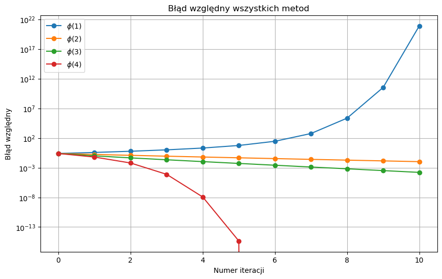
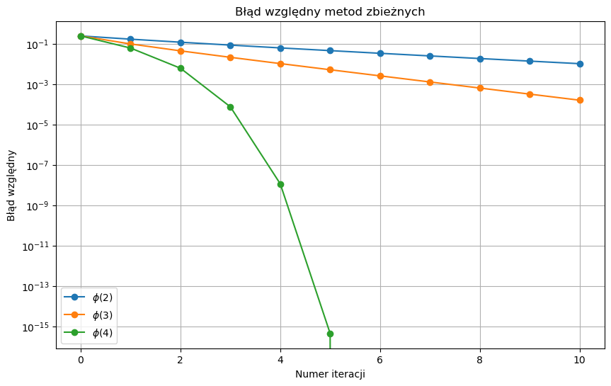

# Równania nieliniowe - metoda Newtona, bisekcji oraz schematy iteracyjne  
**Autor:** Jacek Łoboda, Jakub Staniszewski 
**Data:** 05.05.2026 

---

## 1. Wprowadzenie
Celem niniejszego laboratorium było zapoznanie się z iteracyjnymi metodami rozwiązywania równań nieliniowych. W trakcie zajęć skupiono się na badaniu warunków oraz szybkości zbieżności (wyznaczając jej rząd), a także analizie ograniczeń popularnych algorytmów. Kluczowym elementem zadania było zdiagnozowanie przypadków, w których szybko zbieżna metoda Newtona napotyka problemy i ulega awarii, co zmusza do stosowania innych technik – na przykład metody bisekcji.

## 2. Analiza schematów iteracyjnych

Rozważano równanie $f(x) = x^2 - 3x + 2 = 0$ z pierwiastkiem $\alpha = 2$.

#### Analiza teoretyczna zbieżności

Wartości bezwzględne pochodnych funkcji iterujących w punkcie $\alpha = 2$:
1. $|\phi'_1(2)| = |4/3| \approx 1.33$ (warunek $|\phi'(\alpha)| < 1$ niespełniony $\rightarrow$ rozbieżność)
2. $|\phi'_2(2)| = |3/4| = 0.75$ (zbieżność liniowa, $p=1$)
3. $|\phi'_3(2)| = |1/2| = 0.50$ (zbieżność liniowa, $p=1$)
4. $|\phi'_4(2)| = |0| = 0$ (zbieżność kwadratowa, $p=2$)

#### Analiza wyników empirycznych

Zestawienie danych w Tabeli 1 oraz na wykresach potwierdza powyższe przewidywania:

*   Schemat 1: Zgodnie z teorią wartości $r_k$ nie dążą do stabilnej wartości, a błąd rośnie, co potwierdza rozbieżny charakter punktu stałego.
*   Schemat 2 i 3: Obie metody wykazują zbieżność liniową. Schemat 3 zbiega szybciej, co wynika z mniejszej wartości stałej błędu.
*   Schemat 4: Wykazuje zbieżność kwadratową ($r_k \approx 2$). Metoda szybko redukuje błąd, osiągając granicę precyzji maszynowej w 5. iteracji. Wartości NaN pojawiają się, gdy błąd kolejnego kroku staje się równy zero w ramach precyzji obliczeniowej, co uniemożliwia dalsze wyznaczanie rzędu.

Tabela 1. Wyznaczone rzędy zbieżności $r_k$

| Iteracja | $r_{\phi_1}$ | $r_{\phi_2}$ | $r_{\phi_3}$ | $r_{\phi_4}$ |
| :---: | :---: | :---: | :---: | :---: |
| 1 | 1.1333 | 0.9363 | 0.8604 | 1.6609 |
| 2 | 1.1917 | 0.9529 | 0.9354 | 1.9138 |
| 3 | 1.2818 | 0.9651 | 0.9688 | 1.9944 |
| 4 | 1.4224 | 0.9740 | 0.9847 | 1.9432 |
| 5 | 1.6280 | 0.9806 | 0.9924 | NaN |
| 6 | 1.8544 | 0.9855 | 0.9962 | NaN |
| 7 | 1.9787 | 0.9892 | 0.9981 | NaN |
| 8 | 1.9994 | 0.9919 | 0.9990 | NaN |
| 9 | 1.9999 | 0.9939 | 0.9995 | NaN |

  
  

## 3. Metoda Newtona
W kolejnym etapie badano działanie standardowej funkcji bibliotecznej `scipy.optimize.newton`. Wyznaczono 4 punkty startowe dla podanych funkcji, przy których metoda ulega awarii:
- $f_1(x) = x^3 - 5x$, dla $x_0 = 1.0$
- $f_2(x) = x^3 - 3x + 1$, dla $x_0 = 1.0$
- $f_3(x) = 2 - x^5$, dla $x_0 = 0.01$
- $f_4(x) = x^4 - 4.29x^2 - 5.29$, dla $x_0 = 0.8$

Przyczyny niepowodzeń dla pierwotnych punktów startowych:
1. Wpadanie w cykl oscylacji: $f_1(x)$ w punkcie $x_0 = 1.0$ metoda nie zbiega i zatrzymuje się po 50 iteracjach, przeskakując między skrajnymi wartościami.
2. Pochodna równa zeru: Dla $f_2(x)$ w punkcie $x_0 = 1.0$ pochodna wynosi zero, co od razu przerywa działanie algorytmu błędem w pierwszej iteracji (Derivative was zero).
3. Płaskie otoczenie funkcji: Dla $f_3(x)$ w punkcie $x_0 = 0.01$ ekstremalnie mała wartość pochodnej sprawia, że styczna celuje w duże wartości na osi $OX$. Iteracja wybiega daleko poza obszar poszukiwań (w tym przypadku aż do około $713.6$).
4. Brak zbieżności: Dla $f_4(x)$ w punkcie $x_0 = 0.8$ metoda przez 50 iteracji nie potrafi dotrzeć do celu, utykając w okolicach wartości $0.787$.

Modyfikacja wywołania i rozwiązania alternatywne:
Zgodnie z instrukcją, po wystąpieniu błędu zmodyfikowano wywołanie funkcji, zmieniając punkt startowy na prawy kraniec zadanego w zadaniu przedziału poszukiwań. Jeśli ta modyfikacja nadal nie przynosiła skutku, jako ostatecznego rozwiązania używano innej, bardziej niezawodnej metody, jaką jest bisekcja.

Wyniki po zastosowaniu procedury naprawczej:
a) Równanie $f_1(x) = 0$: Zastosowano funkcję `bisect` w przedziale $[-1, 1]$, która z sukcesem znalazła pierwiastek $x = 0.0$.

b) Równanie $f_2(x) = 0$: Użyto funkcji `bisect` w przedziale $[0, 1]$, uzyskując pierwiastek $x \approx 0.347296$.

c) Równanie $f_3(x) = 0$: Zmiana punktu startowego na $x_0 = 2.0$ rozwiązała problem całkowicie. Zmodyfikowana funkcja `newton` pomyślnie wyznaczyła pierwiastek $x \approx 1.148698$.

d) Równanie $f_4(x) = 0$: Zmiana punktu startowego na $x_0 = 3.0$ pozwoliła na bezproblemowe działanie funkcji `newton`, która znalazła dokładny pierwiastek $x = 2.3$.

## 4. Optymalizacja działań arytmetycznych

W ramach zadania przeanalizowano wykorzystanie metody Newtona-Raphsona do implementacji podstawowych operacji arytmetycznych w systemach, gdzie procesor posiada ograniczony zestaw instrukcji sprzętowych (np. brak jednostki dzielącej). Metoda ta pozwala zastąpić kosztowne operacje (jak ogólne dzielenie) ciągiem szybszych operacji, takich jak mnożenie, odejmowanie oraz przesunięcia bitowe.

### Opis teoretyczny schematów

Dla stałej $c > 0$ wyznaczono następujące iteracyjne schematy obliczeniowe:

- $x = 1/c$
Zaproponowano funkcję $f(x) = \frac{1}{x} - c = 0$, której pochodna to $f'(x) = -\frac{1}{x^2}$.
Podstawiając do ogólnego wzoru Newtona ($x_{n+1} = x_n - \frac{f(x_n)}{f'(x_n)}$), otrzymujemy:
$$x_{n+1} = x_n - \frac{1/x_n - c}{-1/x_n^2} = x_n + x_n^2(1/x_n - c) = x_n(2 - c \cdot x_n)$$
Schemat wykorzystuje wyłącznie odejmowanie i mnożenie.
 

- $x = 1/\sqrt{c}$
Zaproponowano funkcję $f(x) = \frac{1}{x^2} - c = 0$, której pochodna to $f'(x) = -\frac{2}{x^3}$.
Wzór iteracyjny:
$$x_{n+1} = x_n - \frac{1/x_n^2 - c}{-2/x_n^3} = x_n + \frac{x_n^3}{2}(1/x_n^2 - c) = \frac{x_n}{2} (3 - c \cdot x_n^2)$$
Dzielenie przez 2 realizowane jest przesunięciem bitowym.
 

- $x = \sqrt{c}$
Zaproponowano funkcję $f(x) = x^2 - c = 0$, której pochodna to $f'(x) = 2x$.
Wyprowadzenie:
$$x_{n+1} = x_n - \frac{x_n^2 - c}{2x_n} = \frac{1}{2}\left(x_n + \frac{c}{x_n}\right)$$
Wadą jest konieczność wykonywania ogólnego dzielenia ($c / x_n$) w każdej iteracji.
 

- $x = \sqrt{c}$
Aby uniknąć dzielenia, wykorzystujemy wcześniej wyznaczoną iteracyjnie wartośc $1/\sqrt{c}$, a następnie uzyskany wynik mnożymy jednorazowo przez stałą $c$:
$$c \cdot \frac{1}{\sqrt{c}} = \sqrt{c}$$
 

Wyniki testów algorytmów

Poniższa tabela przedstawia porównanie wartości dokładnych z wartościami obliczonymi przy użyciu powyższych schematów dla stałej $c = 5.0$.

| Operacja | Wartość dokładna | Wartość obliczona | Błąd przybliżenia |
| :--- | :--- | :--- | :--- |
| $1/c$ | 0.2 | 0.19999999999999998 | ~2.77e-17 |
| $1/\sqrt{c}$ | 0.4472135954999579 | 0.4472135954999579 | 0.0 |
| $\sqrt{c}$ | 2.23606797749979 | 2.23606797749979 | 0.0 |
| $\sqrt{c}$ | 2.23606797749979 | 2.23606797749979 | 0.0 |

## 5. Układ równań nieliniowych

Napisz schemat iteracji wg metody Newtona dla następującego układu równań nieliniowych
$$x_{1}^{2}+x_{2}^{2}=1$$ 
$$x_{1}^{2}-x_{2}=0$$ 

Pierwiastki tego układu to:
$$x_{1}=\pm\sqrt{\frac{\sqrt{5}-1}{2}}$$ 
$$x_{2}=\frac{\sqrt{5}-1}{2}$$ 

Korzystając z tego, oblicz błąd względny rozwiązania znalezionego metodą Newtona.

#### Rozwiązanie 

Funkcja z której będziemy korzystać w schemacie, będzie funkcją 2 zmiennych:
$$F(x_{1},x_{2})=(x_{1}^{2}+x_{2}^{2}-1, x_{1}^{2}-x_{2})$$

$$F^{\prime}(x_{1},x_{2})=\begin{pmatrix}2x_{1}&2x_{2}\\ 2x_{1}&-1\end{pmatrix}$$

Schemat iteracyjny Newtona dla funkcji wielu zmiennych:
$$X_{k+1}=X_{k}-(F^{\prime}(X_{k}))^{-1}F(X_{k})$$ 
gdzie $X$ jest wektorem zmiennych.

Za punkt startowy obliczeń przyjęliśmy $x_{1}=1$, $x_{2}=0$ i ustawiliśmy 5 iteracji algorytmu.

#### Metoda 

Aby uniknąć kosztownego odwracania macierzy, korzystamy z poniższego przekształcenia:
$$X_{k+1}=X_{k}-(F^{\prime}(X_{k}))^{-1}F(X_{k})$$ 
$$F^{\prime}(X_{k})(X_{k+1}-X_{k})=-F(X_{k}), \quad S=(X_{k+1}-X_{k})$$ 
$$F^{\prime}(X_{k})S=-F(X_{k})$$ 
$$X_{k+1} = S +X_{k}$$ 

Obliczenie $S$ to rozwiązanie liniowego równania $Ax=B$, można to zrobić korzystając z funkcji `scipy.linalg.solve`.

#### Wyniki

| Pierwiastek | Wartość | Błąd | Błąd względny |
| :--- | :--- | :--- | :--- |
| $x_{1}$ | 0.78615 | $4.657 \cdot 10^{-12}$ | $5.924 \cdot 10^{-12}$ |
| $x_{2}$ | 0.61803 | $9.415 \cdot 10^{-14}$ | $1.523 \cdot 10^{-13}$ |

*Tabela 4: Obliczone wartości pierwiastków oraz błędy obliczeń*

Obliczenia są bardzo dokładne, błąd jest widoczny dopiero na 12 miejscu po przecinku. Trzeba zwrócić uwagę na to, że obliczyliśmy tu tylko jeden z pierwiastków $x_{1}$ dlatego że metoda Newtona znajduje tylko jedno rozwiązanie, w tym przypadku jedną parę $(x_{1},x_{2})$.

## 6. Podsumowanie i wnioski końcowe

Przeprowadzone w ramach laboratorium ćwiczenia i analizy pozwoliły na dogłębne zrozumienie specyfiki, zalet oraz ograniczeń algorytmów iteracyjnych stosowanych do rozwiązywania równań i układów równań nieliniowych. Główne wnioski płynące z wykonanych zadań można podsumować w następujących punktach:

* Zależność zbieżności od postaci schematu: Analiza różnych funkcji iterujących udowodniła, że sukces metody i jej szybkość zależą bezpośrednio od zachowania pochodnej w otoczeniu pierwiastka. Metody o zbieżności kwadratowej potrafią zredukować błąd do poziomu precyzji maszynowej w zaledwie kilku krokach, jednak nie gwarantują globalnej zbieżności.
* Wrażliwość metody Newtona: Algorytm Newtona, mimo swojej efektywności, wykazał dużą podatność na błędny dobór punktu startowego. Przypadki takie jak oscylacje, zerująca się pochodna czy płaskie otoczenie funkcji prowadzą do awarii. Wymusza to posiadanie mechanizmów zabezpieczających opartych na metodach wolniejszych, ale bezwzględnie zbieżnych (jak metoda bisekcji).
* Zastosowania sprzętowe i niskopoziomowe: Wyprowadzenie algorytmów dla działań takich jak odwrotność liczby czy pierwiastkowanie pokazało użyteczność metody Newtona-Raphsona w optymalizacji. Umożliwia ona zastąpienie kosztownego sprzętowo dzielenia szybkim ciągiem dodawań, mnożeń oraz przesunięć bitowych bez utraty końcowej dokładności.
* Wysoka precyzja dla układów wielowymiarowych: Rozszerzenie koncepcji Newtona na układy równań nieliniowych z wykorzystaniem macierzy Jacobiego skutkuje szybkim zbieganiem do rozwiązania (błędy rzędu $10^{-12}$ już po 5 iteracjach). Kluczową praktyką optymalizacyjną w tym kroku jest unikanie bezpośredniego odwracania macierzy na rzecz znacznie efektywniejszego rozwiązywania układu równań liniowych ($Ax=B$).

Konkluzja: Laboratorium zilustrowało wyraźny dualizm w algorytmach numerycznych – kompromis między szybkością a niezawodnością. Z tego względu współczesna praktyka programistyczna najczęściej opiera się na rozwiązaniach hybrydowych. Najlepsze i najbezpieczniejsze rezultaty uzyskuje się, rozpoczynając obliczenia od solidnej, lecz powolnej metody (np. bisekcji) w celu zlokalizowania odpowiedniego otoczenia pierwiastka, a następnie przełączając się na szybko zbieżną metodę iteracyjną (jak metoda Newtona), co pozwala zoptymalizować sumaryczny czas i koszt obliczeń.

## 7. Bibliografia
- Plik lab8.pdf
- Wykład "Równania nieliniowe"