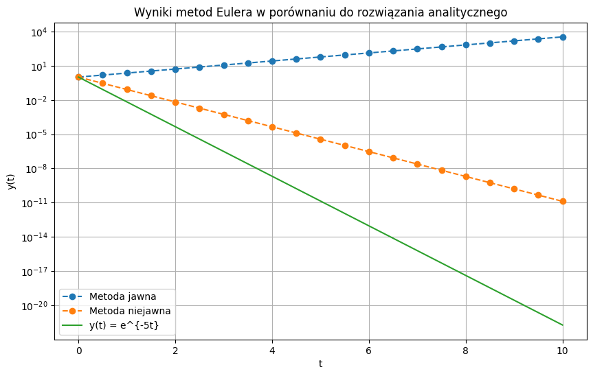
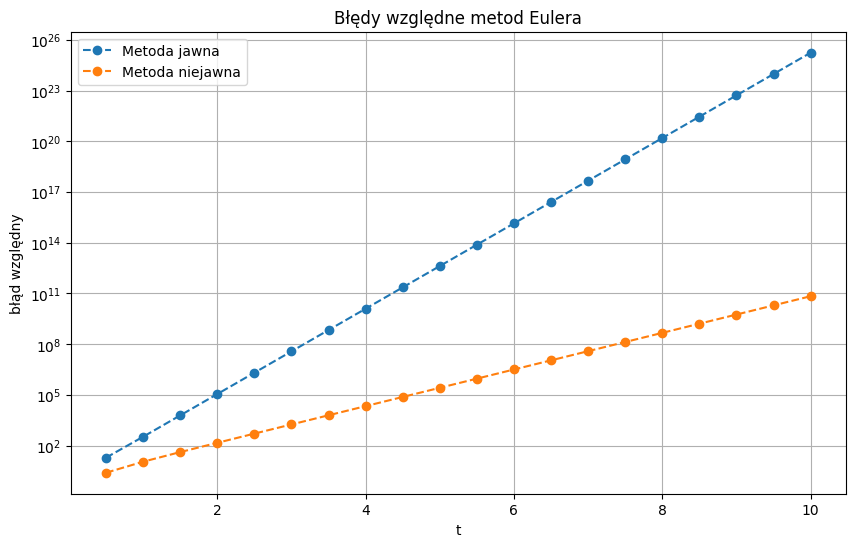
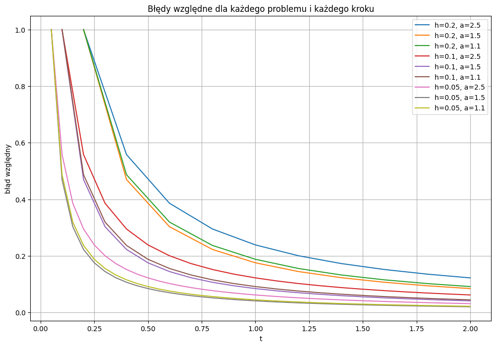
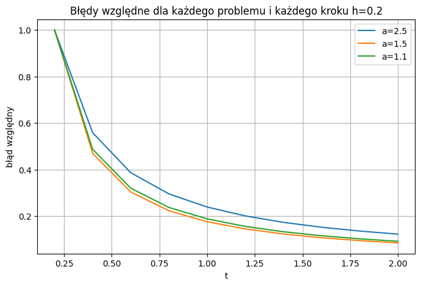
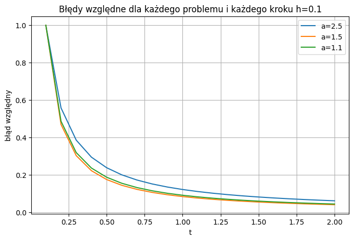
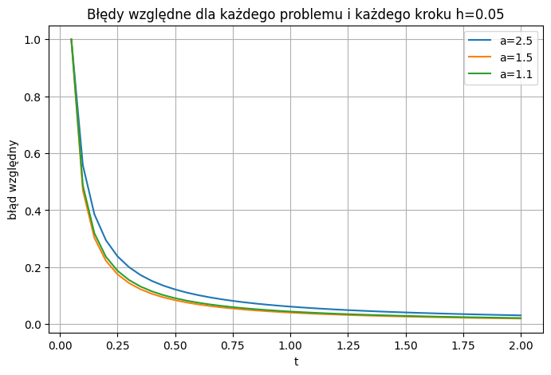

# Sprawozdanie: Metody obliczeniowe w nauce i technice – Laboratorium 9
**Temat:** Równania różniczkowe zwyczajne - część I  
**Autorzy:** Jakub Staniszewski, Jacek Łoboda
**Data:** 11.05.2026  

---

### 1. Cel ćwiczenia i opis metod
Celem niniejszego ćwiczenia laboratoryjnego jest zapoznanie się z metodami numerycznego rozwiązywania równań różniczkowych zwyczajnych (ODE). W ramach zadań dokonano przekształceń równań wyższych rzędów do równoważnych układów równań pierwszego rzędu oraz zbadano stabilność analityczną i numeryczną problemów. Główny nacisk położono na analizę metody Eulera w wariancie jawnym oraz niejawnym, badając jej zbieżność, obszar stabilności oraz zachowanie dla różnych wartości kroku całkowania $h$.

---

### 2. Zadanie 1. Przekształcenia do układów pierwszego rzędu
Należy przedstawić równania różniczkowe jako równoważne układy równań pierwszego rzędu.

**(a) Równanie Van der Pol'a:** $y^{\prime\prime}=y^{\prime}(1-y^{2})-y$  
Wprowadzamy nową zmienną pomocniczą $v = y^{\prime}$. Układ równań ma postać:
$$\begin{cases}y^{\prime}=v\\ v^{\prime}=v(1-y^{2})-y\end{cases}$$

**(b) Równanie Blasiusa:** $y^{\prime\prime\prime}=-yy^{\prime\prime}$  
Wprowadzamy zmienne $u = y^{\prime}$ oraz $v = u^{\prime} = y^{\prime\prime}$. Układ przyjmuje postać:
$$\begin{cases}y^{\prime}=u\\ u^{\prime}=v\\ v^{\prime}=-yv\end{cases}$$

**(c) II zasada dynamiki Newtona dla problemu dwóch ciał:** $y_{1}^{\prime\prime}=-GMy_{1}/(y_{1}^{2}+y_{2}^{2})^{3/2}$  
$y_{2}^{\prime\prime}=-GMy_{2}/(y_{1}^{2}+y_{2}^{2})^{3/2}$  
Wprowadzamy zmienne prędkości $v_{1} = y_{1}^{\prime}$ i $v_{2} = y_{2}^{\prime}$. Układ to:
$$\begin{cases}y_{1}^{\prime}=v_{1}\\ y_{2}^{\prime}=v_{2}\\ v_{1}^{\prime}=-GMy_{1}/(y_{1}^{2}+y_{2}^{2})^{3/2}\\ v_{2}^{\prime}=-GMy_{2}/(y_{1}^{2}+y_{2}^{2})^{3/2}\end{cases}$$

---

### 3. Zadanie 2. Autonomizacja problemu początkowego
Przekształcenie problemu z jawną zależnością od czasu $t$ do postaci autonomicznej.  
$y_{1}^{\prime}=y_{1}/t+y_{2}t$  
$y_{2}^{\prime}=t(y_{2}^{2}-1)/y_{1}$  
Wprowadzamy dodatkową zmienną $y_{3} = t$, gdzie $y_{3}^{\prime} = 1$. Otrzymujemy układ autonomiczny:
$$\begin{cases}y_{1}^{\prime}=y_{1}/y_{3}+y_{2}y_{3}\\ y_{2}^{\prime}=y_{3}(y_{2}^{2}-1)/y_{1}\\ y_{3}^{\prime}=1\end{cases}$$
Warunki początkowe: $y_{1}(1)=1, y_{2}(1)=0, y_{3}(1)=1$.

---

### 4. Zadanie 3. Analiza analityczna rozwiązania
Dany jest problem $y^{\prime}=\sqrt{1-y}$   przy    $y(0)=0$.  
Sprawdzamy funkcję $y(t)=t(4-t)/4$.  
Pochodna: $y^{\prime}(t) = (4-2t)/4 = 1 - t/2$.  
Podstawienie: $\sqrt{1 - \frac{4t-t^2}{4}} = \sqrt{\frac{4-4t+t^2}{4}} = \sqrt{\frac{(2-t)^2}{4}} = |1 - t/2|$.  
Równanie jest spełnione dla $1 - t/2 \ge 0$, czyli $t \le 2$.  
Dziedzina: $t \in [0, 2]$.

---

### 5. Zadanie 4. Stabilność i zbieżność metod Eulera
Równanie $y^{\prime}=-5y, y(0)=1$. Rozwiązanie analityczne: $y(t)=e^{-5t}$.

* **Stabilność analityczna:** Rozwiązanie dąży asymptotycznie do 0 dla $t \to \infty$, więc problem jest stabilny.
* **Zbieżność:** Wykorzystując $\lim_{h \to 0}(1+h)^{1/h} = e$, pokazano, że $y_{n} = (1-5h)^{t/h} \to e^{-5t}$.
* **Stabilność numeryczna ($h=0.5$):** Dla metody jawnej $|1+h\lambda| = |1+0.5(-5)| = 1.5 > 1$ (niestabilna). Metoda niejawna jest stabilna dla każdego $h>0$.
* **Tolerancja ($0.001$):** Aby błąd nie przekroczył $0.001$ przy $t=0.5$, wymagany krok to $h \approx 0.001948$, co wymaga $n=257$ kroków.

* **Iteracja bezpośrednia:** Warunek zbieżności iteracji w metodzie niejawnej to $h < 1/5$. Metoda Newtona jest uzasadniona, gdyż znajduje rozwiązanie w jednej iteracji dla równania liniowego.

---

### 6. Zadanie 5. Układ równań liniowych
Analiza układu $y_{1}^{\prime}=-2y_{1}+y_{2}, y_{2}^{\prime}=-y_{1}-2y_{2}$.  
Wartości własne macierzy układu to $\lambda = -2 \pm i$.  
Warunek stabilności metody jawnej: $|1 + (-2 \pm i)h| < 1$.  
Z obliczeń $\sqrt{(1-2h)^2 + h^2} < 1 \implies 5h^2 - 4h < 0$, co daje $h \in (0, 0.8)$.

---

### 7. Zadanie 6. Badanie rzędu zbieżności
Problem $y^{\prime}=\alpha t^{\alpha-1}, y(0)=0$.  
Rozwiązanie zbadano dla $\alpha \in \{2.5, 1.5, 1.1\}$ przy krokach $h \in \{0.2, 0.1, 0.05\}$. Dla $\alpha = 2.5$ błąd metody Eulera jest największy, a w zerze pojawiają się problemy numeryczne.

**Empiryczne rzędy zbieżności:** * Dla $\alpha=1.1$: $r \approx 0.905$
* Dla $\alpha=1.5$: $r \approx 1.290$
* Dla $\alpha=2.5$: $r \approx 1.865$

Jak widać na wykresach powyżej, kształt wykresów jest bardzo podobny dla różnych wartości $h$, jedynie te o mniejszym $h$ mają mniejsze błędy. Dużo większą różnicę można obserwować dla różnych wartości $\alpha$.

---

### 8. Wnioski
Dzisiejsze laboratorium nauczyło nas dużo o numerycznym rozwiązywaniu równań różniczkowych. Początkowe zadania przypominają wiedzę z matematyki oraz pokazują, że umiejętność analitycznego przekształcania równań jest ważna również przy metodach numerycznych. Dalsze zadania skupiały się na zastosowaniu metody Eulera. Pokazały jej ograniczenia (kiedy przestaje być stabilna numerycznie) oraz dały obraz, jak kształtuje się dokładność tej metody dla różnych problemów i wartości kroków.

---